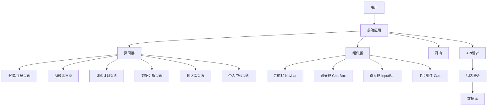
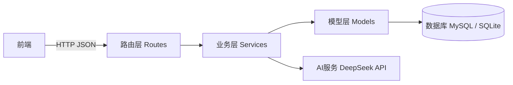
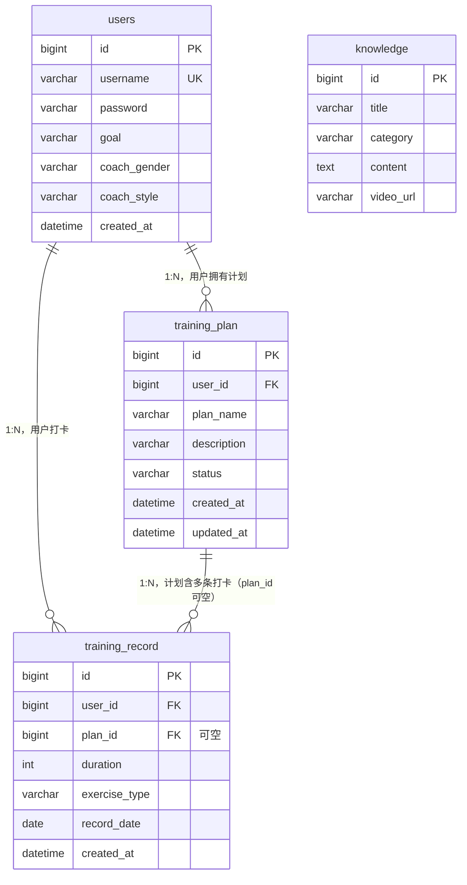
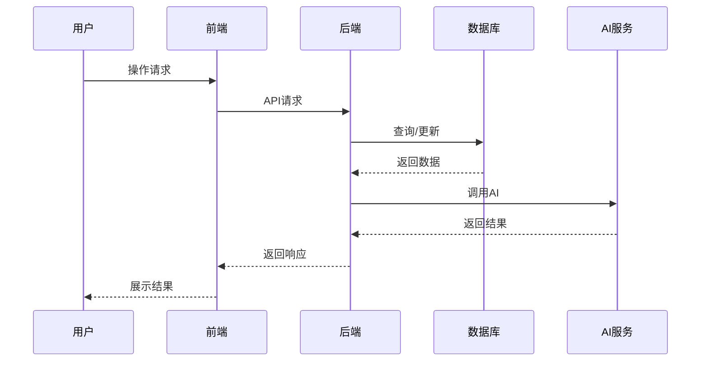

# FitMate——系统架构设计文档

##  一、前端架构设计

### 1. 前端总体架构说明

本项目前端采用组件化开发模式，基于现代前端框架实现页面与逻辑分离，整体结构清晰、可扩展性强。

前端主要分为：

- 页面层（Pages）
- 组件层（Components）
- 路由层（Router）
- 数据请求层（API）
- 样式层（Styles）



### 2. 前端技术栈

本项目前端采用现代前端技术栈，实现组件化开发与前后端分离：

- 框架：Vue 3（组件化开发）
- 构建工具：Vite
- 语言：JavaScript
- 路由管理：Vue Router
- 网络请求：Axios
- 样式：CSS3 + 响应式布局（Responsive Design）

### 3. 页面结构

| 页面名称       | 路径       | 功能             |
| -------------- | ---------- | ---------------- |
| 登录页         | /login     | 用户登录         |
| 注册页         | /register  | 用户注册         |
| 首页（AI教练） | /home      | AI交互、运动建议 |
| 训练计划页     | /plan      | 查看训练计划     |
| 知识库页       | /knowledge | 浏览健身知识     |
| 数据分析页     | /analysis  | 展示运动数据     |
| 个人中心页     | /profile   | 用户信息管理     |

### 4. 组件结构

#### 公共组件（复用）

- Navbar（导航栏）
- Sidebar（侧边栏）
- Button（按钮）
- Input（输入框）
- Card（卡片）

#### 功能组件（业务相关）

- CoachCard（AI教练展示）
- ChatBox（聊天记录区）
- InputBar（输入区）
- PlanCard（训练卡片）
- KnowledgeCard（知识卡片）
- StatCard（数据卡片）

### 5. 前端目录结构

```
src/
├── assets/        # 图片、图标
├── components/    # 公共组件
├── pages/         # 页面
├── router/        # 路由配置
├── api/           # 接口请求
├── styles/        # 全局样式
├── utils/         # 工具函数
├── App.jsx
└── main.jsx
```

## 二、后端架构设计

### 1. 后端总体架构说明

后端采用 **Python Flask** 框架，以 RESTful API 风格向前端提供 JSON 数据接口。

整体分为四层：

- **路由层（`routes/`）**：接收 HTTP 请求，解析参数，调用业务层，需登录接口使用 `@jwt_required()` 鉴权
- **业务层（`services/`）**：封装具体业务逻辑，如用户注册登录、AI 对话、训练计划增删改查、数据统计聚合等
- **模型层（`models/`）**：使用 SQLAlchemy ORM 定义与数据库表一一对应的 Python 类
- **工具层（`utils/`）**：数据库连接与 JWT 扩展初始化、统一 JSON 响应封装等通用能力

**设计原因：**

- **分层架构**使各层职责单一，接口变更只影响路由层，业务逻辑集中管理，改动范围可控
- **统一 `/api` 前缀**便于 Nginx 反向代理与网关转发，也一眼区分接口路径与静态资源
- **统一 JSON 响应**（`code` / `message` / `data`）让前端 Axios 只写一套解析逻辑，减少联调成本
- **Flask 轻量灵活**：适合本项目快速迭代节奏，答辩时也容易演示

### 2. 架构图



### 3. 技术栈与职责

| 技术 | 用途 |
|------|------|
| Flask | Web 框架、蓝图注册 |
| Flask-SQLAlchemy | ORM 模型层，Python 类与数据库表映射 |
| Flask-JWT-Extended | JWT 无状态认证，Token 有效期 7 天 |
| Flask-CORS | 解决前后端分离跨域问题 |
| PyMySQL | MySQL 驱动，配合 `DATABASE_URL = mysql+pymysql://...` 使用 |
| python-dotenv | 从 `.env` 文件读取敏感配置（数据库密码、API Key 等） |

### 4. 后端目录结构

```
backend/
├── app.py                  # 应用入口：创建实例、注册蓝图、初始化数据库
├── config.py               # 配置类：DATABASE_URL、SECRET_KEY、JWT 配置
├── requirements.txt         # Python 依赖清单
├── schema_mysql.sql         # MySQL 建表脚本（生产环境使用）
├── .env / .env.example     # 环境变量（勿提交 Git）
│
├── models/                 # 数据模型层（ORM）
│   ├── user.py             # users 表
│   ├── plan.py             # training_plan 表
│   ├── record.py           # training_record 表
│   └── knowledge.py         # knowledge 表
│
├── routes/                 # 路由层（蓝图）
│   ├── user_routes.py      # /api/register、/api/login、/api/user/profile
│   ├── ai_routes.py        # /api/ai/chat
│   ├── plan_routes.py      # /api/plans、/api/plans/generate、/api/plans/{id}/check-in
│   ├── knowledge_routes.py  # /api/knowledge、/api/knowledge/search、/api/knowledge/{id}
│   └── stats_routes.py     # /api/stats/summary、/api/stats/advice
│
├── services/               # 业务逻辑层
│   ├── user_service.py      # 用户注册、登录、资料更新
│   ├── ai_service.py       # 调用 DeepSeek API 构建 Prompt 与处理回复
│   ├── plan_service.py      # 训练计划 CRUD 与打卡逻辑
│   ├── knowledge_service.py # 知识查询与关键词搜索
│   └── stats_service.py     # 数据统计聚合与 AI 建议生成
│
├── utils/                   # 工具层
│   ├── extensions.py        # db、jwt 单例初始化
│   └── response.py         # ok() / fail() 统一 JSON 响应封装
│
└── data/                    # 测试数据
    └── seed_data.py          # 知识库初始数据
```

### 5. 接口设计要点

**统一响应格式：**

```json
{
  "code": 200,
  "message": "success",
  "data": {}
}
```

**认证机制：**

- `POST /api/login` 返回 JWT Token（有效期 7 天）
- 需登录的接口使用装饰器 `@jwt_required()`
- 请求头格式：`Authorization: Bearer <token>`

详细接口列表见项目根目录 `api.md`。

---

## 三、数据库设计

### 1. 数据库总体说明

- **数据库名**：`fitmate`
- **字符集**：`utf8mb4`（支持中文与 emoji）
- **核心表**：用户、训练计划、训练记录、知识库（共 4 张）

**设计原因：**

- **MySQL + utf8mb4**：支持健身内容中的中文动作名称与动作描述
- **四张核心表围绕核心业务**：用户 → 训练计划 → 打卡记录，形成完整的训练管理链路；知识库独立，与用户解耦，供全站共享浏览
- **1:N 关系**：一个用户可拥有多个计划和打卡记录，结构清晰、扩展方便
- **`plan_id` 可空**：打卡记录可以不属于任何计划，支持自由打卡场景
- **索引优化**：用户名唯一索引加速登录查询；`user_id`、`record_date` 索引加速统计聚合

### 2. E-R 图



### 3. 表间关系

| 关系 | 说明 |
|------|------|
| 用户 → 训练计划 | **1 : N**，`training_plan.user_id` → `users.id` |
| 用户 → 训练记录 | **1 : N**，`training_record.user_id` → `users.id` |
| 训练计划 → 训练记录 | **1 : N**，`training_record.plan_id` → `training_plan.id`（**可为空**，支持不关联计划的自由打卡） |
| 知识库 | 独立表，无用户外键，供全站浏览与关键词检索 |

### 4. 落地方式

| 方式 | 说明 |
|------|------|
| **ORM 模型** | `backend/models/*.py` 与四张表一一对应，开发阶段 `db.create_all()` 自动同步表结构 |
| **MySQL 脚本** | `backend/schema_mysql.sql` 用于生产环境手工初始化或 DBA 审查 |
| **详细字段说明** | 字段类型、约束、索引、示例数据，见 `docs/database.md` |

---

## 四、系统交互流程设计

### 1. 总体交互流程

系统整体交互流程如下：

1. 用户在前端页面发起操作（如登录、输入训练需求等）
2. 前端接收用户输入，并通过 API 向后端发送请求（JSON 格式）
3. 后端接收请求后进行业务逻辑处理
4. 若涉及数据操作，后端访问数据库进行查询或更新
5. 若涉及智能分析，后端调用 AI 服务生成结果
6. 后端将处理结果封装后返回前端
7. 前端接收结果并更新界面展示



### 2. 页面级交互流程

#### （1）登录 / 注册模块

1. 用户输入账号信息
2. 前端进行校验
3. 前端发送请求至后端
4. 后端校验用户信息并访问数据库
5. 后端返回结果
6. 前端提示并跳转页面

#### （2）AI 教练模块（默认首页）

##### 1）消息交互功能

1. 用户输入训练需求
2. 前端发送请求至后端
3. 后端解析请求并调用 AI 服务
4. AI 返回训练建议
5. 后端封装数据并返回
6. 前端展示聊天内容

##### 2）教练个性设置（性别/性格）

1. 用户选择 AI 教练的性别或性格（如严厉型、鼓励型等）
2. 前端将用户选择发送至后端
3. 后端保存用户偏好设置（数据库）
4. 在后续请求中，后端将个性参数传递给 AI 服务
5. AI 根据设定生成对应风格的回复
6. 前端展示具有个性化风格的教练内容

#### （3）训练计划模块

##### 1）计划获取

1. 页面加载时前端发送请求
2. 后端查询数据库
3. 返回训练计划数据
4. 前端展示计划列表

##### 2）计划删除

1. 用户点击删除按钮
2. 前端发送删除请求
3. 后端删除数据库数据
4. 返回结果并更新页面

##### 3）AI 生成创建

1. 用户输入训练目标
2. 前端发送请求至后端
3. 后端调用 AI 服务生成计划
4. 保存至数据库
5. 返回结果并展示

##### 4）手动创建

1. 用户填写训练计划内容
2. 前端发送请求至后端
3. 后端保存数据至数据库
4. 返回结果并更新页面

##### 5）今日打卡

1. 用户点击打卡按钮
2. 前端发送请求至后端
3. 后端记录打卡数据
4. 返回结果并更新状态

#### （4）知识库模块

1. 页面加载请求知识数据
2. 后端查询数据库并返回内容
3. 用户输入关键词进行搜索
4. 前端发送搜索请求
5. 后端检索数据
6. 返回匹配结果
7. 前端展示列表或详情

#### （5）数据分析模块

1. 前端请求统计数据
2. 后端查询数据库
3. 后端进行数据聚合处理
4. 返回统计结果
5. 前端生成图表展示
6. 用户切换时间范围
7. 前端重新发送请求
8. 后端返回新数据
9. 前端更新图表

#### （6）个人中心模块

1. 页面加载请求用户信息
2. 后端查询数据库
3. 返回用户数据
4. 前端展示用户资料
5. 用户修改信息
6. 前端发送更新请求
7. 后端更新数据库
8. 返回结果
9. 前端提示并刷新页面

### 3. 页面跳转流程

1. 用户进入系统后首先访问登录或注册页面
2. 登录成功后跳转至 AI 教练首页
3. 用户通过导航栏访问各功能页面
4. 页面之间通过前端路由切换
5. 各页面在加载时独立请求数据