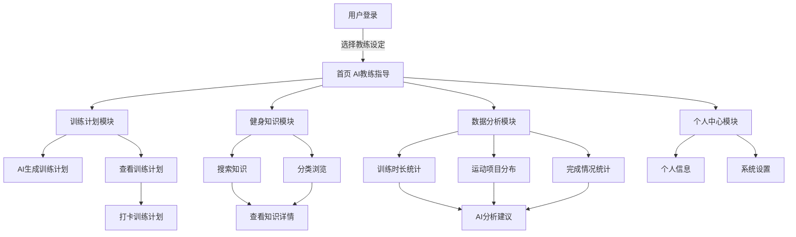

# FitMate——前端说明

## 一、模块功能

​	前端主要负责系统界面展示与用户交互，实现 AI 教练互动、训练计划管理、知识学习以及数据分析展示等功能。整体系统采用WEB响应式设计，支持移动端/PC浏览器访问。

​	前端主要包含以下页面模块：

### 1. 首页（AI 教练页面）

首页为系统主要入口，展示 AI 教练形象。用户可以：

- 选择教练性别（男教练 / 女教练）
- 选择教练性格（温和型 / 严谨型 / 活力型）
- 可与 AI 教练进行聊天互动

### 2. 训练计划页面

该页面用于管理用户训练计划，包括：

- AI 生成训练计划
- 手动创建训练计划
- 修改训练计划
- 查看每日训练任务
- 训练打卡

### 3. 知识库页面

知识库页面提供健身相关知识内容，用户可以：

- 分类浏览运动知识
- 关键词搜索
- 查看教学知识/视频

### 4. 数据分析页面

该页面用于展示用户训练统计数据，包括：

- 最近一周/一个月训练时长
- 训练次数统计
- 运动项目分布
- AI运动分析建议

通过图表方式进行可视化展示。

### 5. 个人中心页面

个人中心用于管理用户信息，包括：

- 用户资料
- 系统设置



---

## 二、技术选型

前端主要采用以下技术：（初步规划）

- Vue.js：构建前端页面框架
- HTML5：页面结构设计
- CSS3：页面样式设计
- JavaScript：页面交互逻辑
- Axios：前后端 API 通信
- ECharts：数据可视化图表

---

## 三、目录结构

前端项目主要目录结构如下：（初步规划）

```
frontend/
│
├─ src/ #源代码
│  │
│  ├─ pages/         #页面组件
│  ├─ components/    #可复用组件
│  ├─ api/           #API请求封装
│  │   └─ api.js
│  │ 
│  └─ main.js        #Vue应用入口文件
│
└─ package.json      #前端项目配置文件
```

---

## 四、运行方式

1. 安装依赖

```
npm install
```

2. 启动前端项目

```
npm run dev
```

